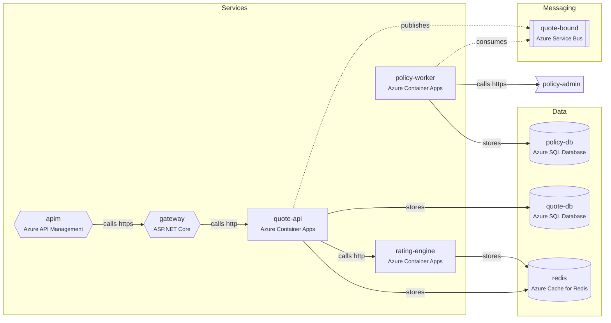

# AgentAtlas

**AgentAtlas maps how your services connect and hands that map to AI agents, so they understand your whole system before they touch it.**

AI coding agents see one repo, one folder, or one file at a time. They don't know which services call which, who consumes a message, or what breaks downstream. AgentAtlas builds that map from what you already have (code, compose files, Bicep, OpenAPI specs, and OpenTelemetry traces) and gives it to agents three ways:

| Output | For |
|---|---|
| `SYSTEM.md` | Any agent or human. Topology diagram, service tables, dependencies, flows. |
| `.agentatlas/atlas.yaml` | Tools and CI. The full graph, committed alongside the code. |
| MCP server (`agentatlas mcp`) | Agents that can call tools: dependencies, callers, blast radius, flow tracing. |

## Quick start

```bash
npx agentatlas init      # creates agentatlas.yaml
npx agentatlas scan      # writes .agentatlas/atlas.yaml and SYSTEM.md
npx agentatlas impact rating-engine
```

```text
Changing rating-engine can affect 3 node(s):
Direct dependents:
- quote-api [service] (quote-api calls rating-engine)
2 hops away:
- gateway [gateway] (gateway calls quote-api)
3 hops away:
- apim [gateway] (apim calls gateway)
Flows that pass through rating-engine: post-v1-quotes
```

Commit `agentatlas.yaml`, `.agentatlas/atlas.yaml`, and `SYSTEM.md`. Run `agentatlas check` in CI to catch drift.

## What it finds

| Scanner | Reads | Finds |
|---|---|---|
| `dotnet` | `*.csproj`, `appsettings*.json` | Web APIs, workers, Functions, YARP/Ocelot gateways; data stores from packages and connection strings; HTTP calls from `*Url`/`*Endpoint`/`*Address` settings; topics, queues, and subscriptions from messaging settings. Test projects are skipped; libraries contribute their packages to the services that reference them. |
| `java` | `pom.xml`, `build.gradle(.kts)`, `application*.yml/.properties` | Spring Boot, Micronaut, and Quarkus apps, with data and messaging clients from Maven/Gradle dependencies. Spring config adds datasources, Redis hosts, Spring Cloud Stream bindings, and client URLs. Aggregator (`packaging: pom`) modules and libraries without a web starter are skipped. |
| `go` | `go.mod`, `*.go` | One node per `package main` directory (the common `cmd/<service>/main.go` layout), with framework (Gin, Echo, Fiber, chi, gorilla/mux, gRPC) and infra clients from `go.mod` requires. |
| `python` | `pyproject.toml`, `requirements.txt` | Django, Flask, FastAPI, Tornado, aiohttp, and Starlette apps, with data and messaging clients from their dependencies. Projects without a recognized web framework are skipped. |
| `node` | `package.json` | Express, Fastify, NestJS, Koa, Hono, Next.js, Nuxt, Remix, Angular, Vue, Svelte, plain React, and Azure Functions apps, with their data and messaging clients |
| `env` | `.env`, `.env.example`, `.env.*` | Connection strings, service URLs, and topic and queue names, attached to the service whose folder holds the file. Works for every language. Values stay local: only ids, tech, and external origins reach the atlas. |
| `routes` | `*.java`, `*.kt`, `*.cs`, `*.py`, `*.js/ts`, `*.go` | Endpoints declared in code for services with no OpenAPI document: Spring `@GetMapping`, ASP.NET `[HttpGet]` and `MapGet`, FastAPI and Flask decorators, Express and Nest routes, Gin/Echo/chi registrations |
| `codeowners` | `.github/CODEOWNERS`, `CODEOWNERS`, `docs/CODEOWNERS` | Attributes each service's `owner` from the pattern that last matches its code folder, so `impact` can say who to tell. A manual `owner` in `agentatlas.yaml` always wins. |
| `compose` | `docker-compose*.yml`, `compose*.yaml` | Services and infrastructure containers, `depends_on`, and hostnames in environment variables. Build contexts link compose services to code projects automatically. |
| `openapi` | `openapi*.yaml/json`, `swagger*.json` | Endpoints, attached to the code project that contains the spec |
| `bicep` | `*.bicep` | Container Apps, App Service, Functions, API Management, SQL, Cosmos DB, Redis, Service Bus topics and queues, Event Hubs, Storage, AI Search. Container `env:`, `appSettings`, and `connectionStrings` become edges, with `${resource.properties…}` references resolved to the resource they point at. |
| `terraform` | `*.tf` | The same resource families as `bicep`, for `azurerm_*` and `aws_*` types (other providers aren't recognized yet). `environment`/`app_settings`/`env` blocks become edges the same way. |
| `k8s` | Kubernetes manifests, Helm `templates/` | Deployments, StatefulSets, DaemonSets, Jobs, and CronJobs, with `env` and `envFrom` config; Services name the workload behind them; Ingress backends become gateway edges; images link workloads to code projects. Helm charts are rendered best-effort from `values.yaml`. |
| `asyncapi` | `asyncapi*.yaml/json` | Message/event names for a topic or queue (AsyncAPI v2 and v3), the way `openapi` documents a service's endpoints. When a topic's contract is unambiguous (one message type), it's attached to the edges that publish or consume it. |
| `otel` | OTLP JSON trace exports | Observed calls, publishes, consumes, and database access, with counts; the callee's own endpoint on `calls` edges; end-to-end **flows** built from each trace |

Every node and edge records which sources found it. When sources disagree, the manual config wins, then code, then IaC, then traces.

## Using it with agents

### Claude Code

Install the plugin, which adds the MCP server and a skill that tells Claude when to use it:

```
/plugin marketplace add senthil-sekar/agent-atlas
/plugin install agentatlas@agentatlas
```

Then run `/agentatlas:map` to scan, or ask things like "what breaks if I change the quote-bound message?"

Or add only the MCP server:

```bash
claude mcp add agentatlas -- npx -y agentatlas mcp
```

### Cursor, VS Code (Copilot), and other MCP clients

```json
{
  "mcpServers": {
    "agentatlas": { "command": "npx", "args": ["-y", "agentatlas", "mcp"] }
  }
}
```

Put this in `.cursor/mcp.json` for Cursor. VS Code uses `.vscode/mcp.json` with `"servers"` as the top-level key.

### Anything else

Point the agent at `SYSTEM.md`, for example with a line in `AGENTS.md`:

```markdown
Before changing code that crosses a service boundary, read SYSTEM.md.
```

## MCP tools

All tools are read-only.

| Tool | Answers |
|---|---|
| `system_overview` | What is this system? (`brief`, `standard`, or `full`, with an optional token budget) |
| `pack_context` | The smallest map you need before changing one node: direct and transitive dependencies, impact, and flow detail, trimmed to a token budget |
| `get_service` | Everything about one node: tech, hosting, code path, dependencies, users, endpoints, flows |
| `get_dependencies` | What does X depend on, N hops deep? |
| `find_callers` | What depends on X? |
| `impact_of_change` | What could break if X changes, grouped by distance? |
| `trace_flow` | How does a request get from A to B (following async hops)? Or: show a named flow step by step. |
| `list_flows` | Which end-to-end flows are known? |
| `search_atlas` | Where is the thing that handles "bind" or uses Redis? |
| `render_diagram` | Mermaid diagram of the system or one node's neighborhood |
| `validate_design` | Check a proposed design (a Mermaid flowchart or a `{nodes, edges}` fragment) against the live system: broken references, an id reused for something else, edges crossing team ownership, new cycles |

Resources: `atlas://system.md` and `atlas://atlas.yaml`.

The server reads the committed `.agentatlas/atlas.yaml` and reloads it when it changes. If no atlas file exists, it scans on the fly.

## CLI

```text
agentatlas init                     Create agentatlas.yaml
agentatlas scan [--dry-run]         Write .agentatlas/atlas.yaml and SYSTEM.md
agentatlas check                    Exit 1 if the committed atlas no longer matches the code
agentatlas doctor                   Report what scanners could not resolve, with paste-ready fixes
agentatlas summary [--level L]      brief | standard | full   [--max-tokens N]
agentatlas show <id>                One node in detail
agentatlas pack <id> [--depth N] [--max-tokens N]  The smallest map an agent needs before changing <id>
agentatlas deps <id> [--depth N]    What <id> depends on
agentatlas callers <id> [--depth N] What depends on <id>
agentatlas impact <id> [--depth N]  Blast radius
agentatlas path <from> <to>         Route between two nodes
agentatlas flow [id] [--diagram]    List flows or show one
agentatlas diagram [--focus id] [--depth N] [--out file]
agentatlas merge <dir...>           Combine several repos' committed atlases into one [--out dir] [--name] [--config file]
agentatlas fetch-traces             Fetch traces from Jaeger or Application Insights, write OTLP JSON for `scan` to read
agentatlas validate <file>          Check a proposed design (Mermaid flowchart or {nodes,edges} fragment) against the live atlas
agentatlas mcp                      MCP server on stdio
```

Every command accepts `--dir <path>`. Ids can be exact (`quote-api`), a project name (`Contoso.Quote.Api`), or a unique fragment (`rating`).

## Configuration

`agentatlas.yaml` names the system and corrects what scanners can't see or get wrong. Everything is optional except `system.name`.

```yaml
version: 1
system:
  name: Quote-to-Bind
  description: Auto insurance quoting and policy binding.
  owner: Personal Lines Platform

scan:
  exclude: ["legacy/**"]                  # added to the defaults (bin, obj, node_modules, …)
  scanners: [dotnet, java, go, python, node, env, routes, codeowners, compose, openapi, bicep, terraform, k8s, asyncapi, otel]
  traces: ["traces/**/*.json"]            # OTLP JSON exports
  stripPrefixes: [contoso]                # Contoso.Quote.Api → quote-api

aliases:                                  # scanned id → the id you want
  quoteservice: quote-api

ignore: [sqlserver, azurite]              # local emulators, noise

nodes:                                    # add systems scanners can't see, or enrich found ones
  - id: policy-admin
    kind: external
    description: Legacy policy admin (SOAP, on-premises)
    owner: Policy Systems

edges:                                    # connections configured outside the code
  - { from: apim, to: gateway, kind: calls, protocol: https }

flows:                                    # document key journeys by hand
  - id: first-notice-of-loss
    name: Report an accident
    steps:
      - { from: mobile-app, to: claims-api, action: POST /claims }
      - { from: claims-api, to: claim-submitted, action: publish ClaimSubmitted }
```

**Node kinds:** `service`, `function`, `gateway`, `frontend`, `database`, `cache`, `storage`, `search`, `queue`, `topic`, `stream`, `external`.

**Edge kinds** (edges point from the dependent to the dependency): `calls`, `publishes`, `consumes`, `stores`, `depends`.

**Other ways to name a service:** `<AgentAtlasId>` in a `.csproj`, `"agentatlas": { "id": "…" }` in `package.json`, or `x-agentatlas-service` in an OpenAPI document.

## Drift checks in CI

```yaml
- name: System map is up to date
  run: npx -y agentatlas check
```

`check` rescans and compares against the committed atlas. Nodes, edges, tech, and endpoints are compared; trace counts are not. The output lists what changed.

## Multiple repos

`merge` combines several repos' committed atlases into one system view — the map spans repos the way a real platform team's ownership does, without any repo scanning another's code:

```bash
agentatlas merge ../quote-service ../policy-service ../rating-service --out ../platform-map --name "Personal Lines Platform"
```

An id that appears in more than one repo's atlas is treated as the same node — right for a topic every team's service touches, wrong for two repos that coincidentally named a service the same thing. Merge only sees the ids each repo already committed, so it can unify two different ids for the same real resource (`--config` pointing at a file with an `aliases:` section, same shape as `agentatlas.yaml`), but it can't separate a genuine collision after the fact — that's fixed at the source, by giving the repo a distinct id before committing its atlas.

## Traces from a live backend

`otel` reads trace files, and only trace files — scanners stay read-only and network-free so `scan` stays deterministic (see [CONTRIBUTING.md](CONTRIBUTING.md)). `fetch-traces` is the explicit, separate step that talks to a live backend and writes what `otel` reads:

```bash
agentatlas fetch-traces --source jaeger --url http://jaeger:16686 --service quote-api --limit 20
agentatlas fetch-traces --source appinsights --app-id <application-id>   # key: --api-key or APPLICATIONINSIGHTS_API_KEY
agentatlas scan   # folds the new trace file into the atlas like any other
```

Both are best-effort: Jaeger conversion assumes OpenTelemetry semantic-convention attributes (the common case behind an OTel Collector); Application Insights' free-text `dependencies.type` is mapped to the same vocabulary `otel` already understands, falling back to a plain outbound call for a type it doesn't recognize.

## Example

[`examples/quote-to-bind`](examples/quote-to-bind) is a small auto insurance system: a YARP gateway behind API Management, a quote API, a rating engine, a policy worker fed by a Service Bus topic, SQL, Redis, and a legacy SOAP policy system. Nobody drew the diagram or wrote the tables below — `agentatlas scan` produced this straight from the `.csproj` files, `appsettings.json`, `docker-compose.yml`, an OpenAPI spec, and a trace file, then merged everything by id. It's the real, generated [`SYSTEM.md`](examples/quote-to-bind/SYSTEM.md):



| Service | Kind | Tech | Depends on | Used by |
|---|---|---|---|---|
| `apim` | gateway | Azure API Management | `gateway` | — |
| `gateway` | gateway | .NET (net8.0), ASP.NET Core, YARP | `quote-api` | `apim` |
| `policy-worker` | service | .NET (net8.0), Worker Service, SQL Server, WCF client, Azure Service Bus, OpenTelemetry | `policy-admin`, `policy-db`, `quote-bound` | — |
| `quote-api` | service | .NET (net8.0), ASP.NET Core, SQL Server, Redis, Polly, Azure Service Bus, OpenTelemetry, OpenAPI 3.0.3 | `quote-bound`, `quote-db`, `rating-engine`, `redis` | `gateway` |
| `rating-engine` | service | .NET (net8.0), ASP.NET Core, Redis | `redis` | `quote-api` |

`quote-api`'s own entry in `SYSTEM.md` goes further, down to what a trace actually observed:

```text
### quote-api
Owner: Quoting Team · Hosting: Azure Container Apps · Code: src/Contoso.Quote.Api
Found by: dotnet, compose, openapi, bicep, otel, manual

Depends on
- publishes quote-bound — seen 1x in traces
- stores quote-db — seen 2x in traces
- calls rating-engine (http) — seen 1x in traces — POST /v1/premiums
- stores redis

Endpoints
- POST /v1/quotes — Create and price a quote
- GET /v1/quotes/{quoteId} — Get a quote
- POST /v1/quotes/{quoteId}/bind — Bind an accepted quote
```

`system_overview` at `brief` level collapses all of this to one line per node; `pack_context quote-api` gives roughly the block above plus one hop of blast radius, sized to a token budget — that's the shape an agent actually consumes, not the full page.

```bash
npm run build && npm run example
node dist/cli.js path apim policy-admin --dir examples/quote-to-bind
```

## Works with Draftsman

[Draftsman](https://github.com/senthil-sekar/draftsman) reads `SYSTEM.md` and `.agentatlas/atlas.yaml` when designing new features, so designs start from the system you actually have.

The other direction — checking a proposed design against the live topology — is `agentatlas validate` and the `validate_design` MCP tool. Draftsman produces Markdown design docs with Mermaid diagrams, not a machine schema, so `validate` reads a design's Mermaid flowchart (its container/component view) the same best-effort way it would any other tool's diagram, or a structured `{nodes, edges}` fragment for tools that do emit one:

```bash
agentatlas validate docs/design/quote-express/design.md
```

It flags broken references, an id the design reuses for something that already exists as a different kind of node, edges that cross from one team's code into another's, and dependency cycles the design would introduce — as notes and warnings, not a pass/fail gate (`validate` exits 1 only on a warning, so it can gate CI if you want that).

## Development

```bash
npm install
npm run build
npm test
```

Requires Node.js 20+. See [CONTRIBUTING.md](CONTRIBUTING.md) and the [roadmap](docs/roadmap.md).

## License

MIT
