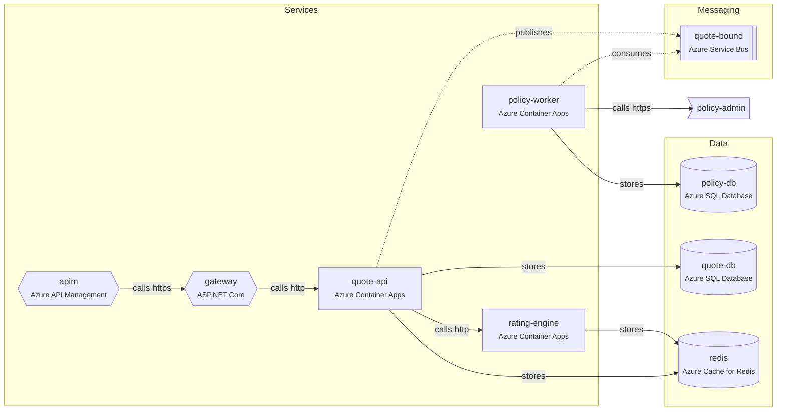
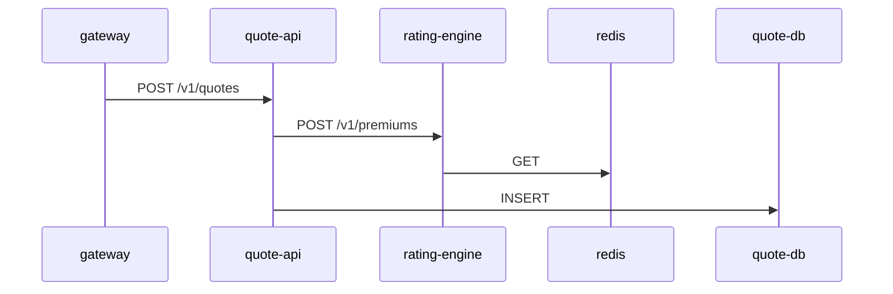
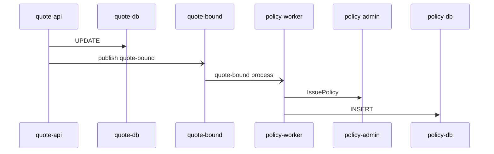

<!-- Generated by AgentAtlas. Do not edit by hand: change agentatlas.yaml or the code, then run `agentatlas scan`. -->
# System map: Quote-to-Bind

Auto insurance quoting and policy binding for agents and direct customers.

## For AI agents

- Read this file before changing code that crosses a service boundary.
- Before changing a service, check **Used by** for everything that may break.
- Edges point from the dependent to the dependency. `publishes`/`consumes` mark async messaging; contracts on those edges are just as binding as HTTP APIs.
- The full graph is in `.agentatlas/atlas.yaml`. If the `agentatlas` MCP server is available, prefer its tools (`get_service`, `impact_of_change`, `trace_flow`).

## Topology

## Services

| Service | Kind | Tech | Depends on | Used by |
|---|---|---|---|---|
| [`apim`](#apim) | gateway | Azure API Management | `gateway` | — |
| [`gateway`](#gateway) | gateway | .NET (net8.0), ASP.NET Core, YARP | `quote-api` | `apim` |
| [`policy-worker`](#policy-worker) | service | .NET (net8.0), Worker Service, SQL Server, WCF client, Azure Service Bus, OpenTelemetry | `policy-admin`, `policy-db`, `quote-bound` | — |
| [`quote-api`](#quote-api) | service | .NET (net8.0), ASP.NET Core, SQL Server, Redis, Polly, Azure Service Bus, OpenTelemetry, OpenAPI 3.0.3 | `quote-bound`, `quote-db`, `rating-engine`, `redis` | `gateway` |
| [`rating-engine`](#rating-engine) | service | .NET (net8.0), ASP.NET Core, Redis | `redis` | `quote-api` |

## Data and messaging

| Resource | Kind | Tech | Writers / publishers | Readers / consumers |
|---|---|---|---|---|
| `policy-db` | database | SQL Server, Azure SQL Database | `policy-worker` | — |
| `quote-db` | database | SQL Server, Azure SQL Database | `quote-api` | — |
| `redis` | cache | Redis, Azure Cache for Redis | `quote-api`, `rating-engine` | — |
| `quote-bound` | topic | Azure Service Bus | `quote-api` | `policy-worker` |

## External systems

| System | Description | Used by |
|---|---|---|
| `policy-admin` | Legacy policy administration system (SOAP, on-premises). Source of truth for issued policies. | `policy-worker` |

## Service details

### apim

Public API edge. Handles subscription keys and throttling, then forwards to the YARP gateway.

**Found by:** bicep, manual

**Depends on**

- calls `gateway` (https)

### gateway

**Code:** `src/Contoso.Gateway` · **Found by:** dotnet, compose, otel

**Depends on**

- calls `quote-api` (http) — seen 1x in traces — POST /v1/quotes

**Used by**

- `apim` calls

### policy-worker

Issues policies in the policy admin system when a quote is bound.

**Owner:** Policy Systems · **Hosting:** Azure Container Apps · **Code:** `src/Contoso.Policy.Worker` · **Found by:** dotnet, compose, bicep, otel, manual

**Depends on**

- calls `policy-admin` (https) — seen 1x in traces
- stores `policy-db` — seen 1x in traces
- consumes `quote-bound` — seen 1x in traces

### quote-api

Creates and prices quotes, and binds accepted quotes.

**Owner:** Quoting Team · **Hosting:** Azure Container Apps · **Code:** `src/Contoso.Quote.Api` · **Found by:** dotnet, compose, openapi, bicep, otel, manual

**Depends on**

- publishes `quote-bound` — seen 1x in traces
- stores `quote-db` — seen 2x in traces
- calls `rating-engine` (http) — seen 1x in traces — POST /v1/premiums
- stores `redis`

**Used by**

- `gateway` calls

**Endpoints**

- `POST /v1/quotes` — Create and price a quote
- `GET /v1/quotes/{quoteId}` — Get a quote
- `POST /v1/quotes/{quoteId}/bind` — Bind an accepted quote

### rating-engine

Calculates premiums from rating factors.

**Owner:** Pricing Team · **Hosting:** Azure Container Apps · **Code:** `src/Contoso.Rating.Engine` · **Found by:** dotnet, compose, bicep, otel, manual

**Depends on**

- stores `redis` — seen 1x in traces

**Used by**

- `quote-api` calls

## Flows

### POST /v1/quotes (gateway)

Observed in traces/quote-and-bind.otlp.json

### POST /v1/quotes/{quoteId}/bind (quote-api)

Observed in traces/quote-and-bind.otlp.json

